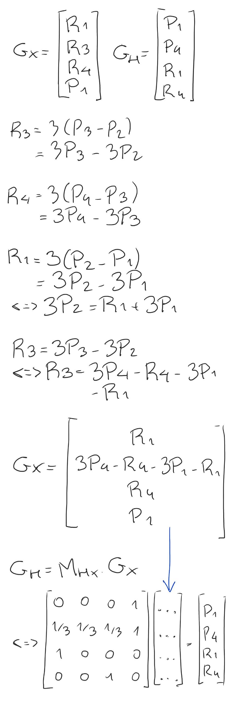
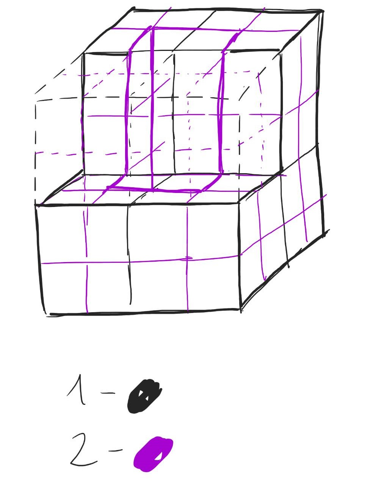

# Exame 2010/2011

1\. a) T(0, -α/90, 0) ← R(α, 0, 1, 0)  
    b) Sim, seria possível, pois ambas as transformações, translação e rotação são realizadas segundo o mesmo eixo Y. 

2\. a) A2, pois é o que possui o menor ângulo de incidência com a fonte de luz.  
    b) B2, pela mesma razão.  
    c) A1, pois apesar da distância entre a fonte de luz e A1/A3 ser a mesma, A1 encontra-se mais próximo do observador.  
    d) A1

3\. 

4\.

5\. a) RGB(128, 0, 0)  
    b) RGB(255, 128, 128)  
    c) HSV(180º, 50%, 25%)  
    d) HSV(60º, 75%, 25%)

6\. 

7\. a)  O objeto em questão encontra-se inscrito num cubo de aresta de 100 de comprimento. Como tal, usando a primitiva "cubo de aresta unitária", seria possível representá-lo através do uso de 100³ cubos de volume unitário que poderiam, ou não, estar visíveis de acordo com um valor booleano associado a cada um.  
    
    b)

8\.