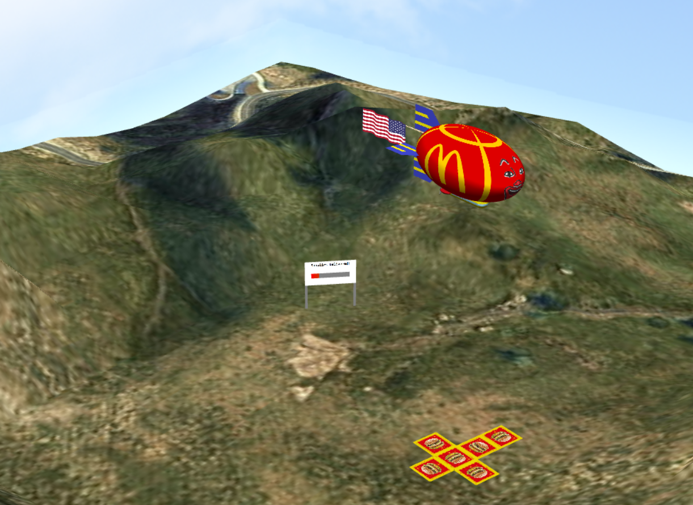

# Computer Graphics

## MIEIC - 2nd year / 2nd semester [🔗](https://sigarra.up.pt/feup/pt/ucurr_geral.ficha_uc_view?pv_ocorrencia_id=436438)

Code developed in Computer Graphics FEUP curricular unit.

## Project [📂](Project/)

The project, named "McDelivery", consists in an interactive web-scene in which you pilot a blimp that delivers supplies.

Click [here](https://educorreia932.github.io/FEUP-CGRA/Project/src/) to see a live demo.